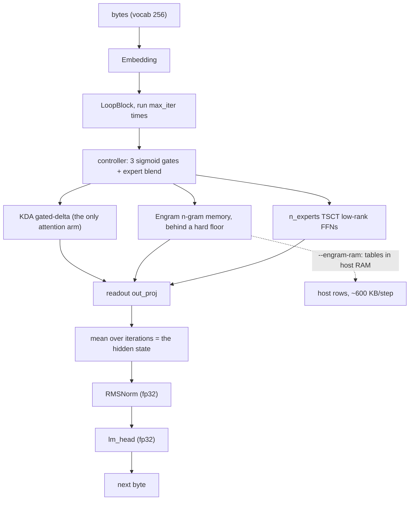
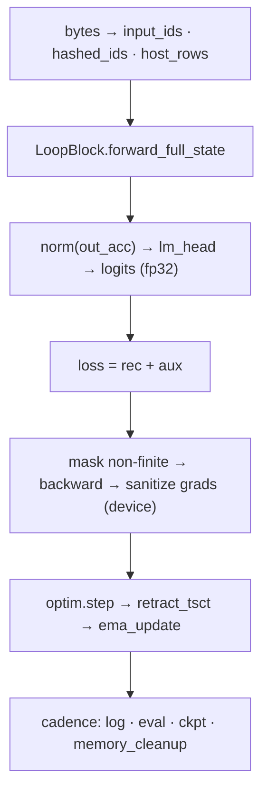

# dormouse — the domain model

dormouse trains byte-level language models for **maximum capability per
gigabyte on one consumer GPU plus host RAM**. This file is the map: the
entities, how they relate, and how one training step actually flows through
them. Reading it end to end should be enough to hold the system in your head.

It is not a summary of the code and not a status report. For the *words* — every
term, where it lives, and what it is confused with — read
[`docs/glossary.md`](docs/glossary.md). For how to work here, read
[`AGENTS.md`](AGENTS.md). For the decisions, read `docs/adr/`.

**The one thing to know before anything else:** the depth of this model comes
from *iterations of one weight-shared block*, not from layers. Everything else
in the architecture follows from that.

---

## The shape



Four layers, each owning its vocabulary:

| layer | crate | owns |
|---|---|---|
| **stream** | `dormouse-data` | bytes, the n-gram hashes, the held-out window |
| **model** | `dormouse-core` | the block, its arms, the config schema, the aux losses |
| **technology library** | `vendor/dormouse-fused/` (26 crates, all ours) | every mechanism and kernel that is not the model: KDA, gdn2, spectral, muon-plus, rmsnorm, bitnet, jepa, dspark, mor, … |
| **run** | `dormouse-train` + `dormouse-cli` | the step, the optimizer policy, checkpoints, resume, recovery |

The library is *ours*, not a dependency: it is vendored in-tree precisely so
every mechanism is a deletable unit with its own tests and its own A/B
(ADR-0017, ADR-0018). The root `Cargo.toml` `exclude`s `vendor/` because those
crates are their own workspace roots — without the exclude, their
`workspace = true` inheritance resolves against ours and the build fails.

---

## The entities

### The bytes

There is no tokenizer. The unit of prediction is one byte, the vocabulary is
256, and the loss is a next-byte cross-entropy. `ByteStream` is a 64 MB ring
refilled in 8 MB chunks from an FNV-sharded, deterministically shuffled file
list; the held-out tail is carved out at filter time so training never sees it
(ADR-0010). The stream can be rewound (every eval does, so every run scores the
same bytes) and fast-forwarded by byte offset (a resume must not re-read).

### The model

`DormouseModel` = `Embedding` → `LoopBlock` → `RMSNorm` → `lm_head`, plus
`AuxHeads` (the JEPA predictor and the DSpark draft head, which are *not* on
the prediction path).

Every wide projection is a `LinearLike`, which is either a low-rank spectral
factorization (TSCT: masters `u`, `s`, `v`; fp32 masters, quantized forward) or
a plain dense linear. `out_features` is padded to a multiple of 4 for the
matrix kernel and sliced back.

### The block and its arms

`LoopBlock` is one module, run `max_iter` times, with **the same weights** and a
recurrence: iteration *n+1* reads iteration *n*'s post-residual state. Inside
one iteration:

1. the **controller** reads `[h_ctx, h0]` and emits `w_attn`, `w_mem`, `w_ffn`
   (sigmoids) and a softmax blend over the experts;
2. three **arms** run in parallel on the same normalized state:
   - **attention**: KDA gated-delta. The only attention mechanism in the
     repository; the sparse MSA arm and its crate were deleted (ADR-0014) and
     the wrapper `AdaptiveAttention` survives only to keep the checkpoint
     parameter prefix `loop_block.shared_attn.gdn2.*` stable;
   - **memory**: the Engram read, mixed with a dense projection under a hard
     floor `lam = min(w_mem, engram_lam_max)`, so the table can never carry more
     than `lam_max` of that branch and the backbone keeps a gradient path;
   - **experts**: `n_experts` TSCT FFNs blended by the controller;
3. the three are **summed** (times the gates) and added residually — a
   ReZero scalar, or a four-branch Gated Residual under `use_gr`;
4. the **readout** `out_proj` projects that state, and the readout of *every*
   iteration is averaged into the model's hidden state.

**Fixed depth is the default** (ADR-0013). PonderNet halting was measured twice
and lost both times — the halting probability collapses, the loss becomes fake,
and the loop is not the value; the recurrent refinement is. Two arms replace it
and are mutually exclusive by construction (`--rand-depth` samples the depth per
step; MoR ranks the iteration slots per position; `resolve` refuses the pair).

### Memory: three distinct objects, one name

| | what | where | trained by |
|---|---|---|---|
| **Engram** | the hashed n-gram **tables inside the model** — the default, 25 000 rows × 3 orders × 32 dims = 2.4M params, a deliberate *minority* of the model | `LoopBlock.engram` | plain Adam, no weight decay, as an ordinary parameter |
| **host rows** | the per-position rows one batch needs, gathered on the host and uploaded (`[b,t,96]`, ~600 KB/step) | `--engram-ram` only | — (a leaf, not a parameter) |
| **HostNgram** | the tables themselves, in host RAM, with one Nesterov momentum buffer and periodic Sinkhorn balancing, checkpointed to `<name>.ngram` | `train/src/offload.rs` | CPU, every step by default |

The rows are **input features only**: nothing is ever written back, and no
memory is produced by the model. The size budget is a *ratio* (DeepSeek's
20-25%), not a slot count, because at 8M rows/order the arm was 99% of the model
and every run needed `--no-engram`.

### Parameters and the optimizer

`routing.rs` answers "what **is** this parameter?" (`Role` × `LinearParam`) and
`optim.rs` answers "which optimizer trains it?" (`Group` × the `--opt` mode).
Muon+ (ColRow, NS 8) on the small low-rank factors and the Engram key
projections; a per-head variant on the KDA q/k; plain Adam with no weight decay
on the tables; AdamW (or Adan) on the rest. The whole point is that 2D *dense*
weights stay off Muon+: fp32 Newton-Schulz on `[d,d]` costs ~40 s/step on this
box, which is a machine fact, not a preference.

TSCT masters are re-orthogonalized every step (a polar retraction) because the
quantized forward depends on it; a per-entry orthonormality check every 500
steps latches an irreversible fp32 fallback if they drift.

### The step

One **step** is one optimizer update at one depth:

| stage | what happens |
|---|---|
| inputs | `input_ids [b,t]` (embedding, bf16 under `--bf16`) · `hashed_ids [b,t,3]` (raw FNV; the model masks the slot index) · `host_rows [b,t,3*32]` (`--engram-ram`; `hashed_ids` then unused) |
| loop | `LoopBlock.forward_full_state(x, hashed_ids, host_rows, targets, lm_head)` — pseudocode below |
| head | `norm(out_acc) → lm_head → logits` — fp32 even under `--bf16` |
| aux | `aux = w_jepa·JEPA + w_dspark·DSpark + w_mor·BCE`; `loss = rec + aux` |
| backward | mask non-finite on device → backward → sanitize grads on device (§1.3: no host sync) |
| optim | `optim.step` (Muon+ / head-wise / Adam-tables / AdamW-rest) → `retract_tsct` every `--retract-every` → `ema_update` the teacher → `max_ortho` every 500 steps (the one-way fp32 latch) |
| cadence | `log_every`: ce/bpb line, aux, pool stats, fused seam counters · `eval_every`: held-out BPB on a rewound window (+ depth curve) · `ckpt_every`: save_ckpt + save_ngram · every 500: `memory_cleanup` |



The loop body, as pseudocode:

```text
for iter in 0..iters:
    h_ctx = h + e_k[iter]                  # or GR read
    normed = RMSNorm(h_ctx)                # identity under GR
    w_attn, w_mem, w_ffn, blend = controller([h_ctx, h0])
    kda_state = KDA(normed, kda_state)     # threaded across iterations
    mem = min(w_mem, lam_max)*engram_read + (1-w_mem)*mem_dense(normed)
    ffn = Σ blend_e * expert_e(normed) * w_ffn
    h = h_ctx + y * residual_scale         # or GR write
    step_out[iter] = out_proj(h)
    ce[iter] = -log_softmax(lm_head(step_out))[target]   # inside the loop
out_acc = mean(gate * step_out)            # gate = all-ones, or MoR's top-k
rec = mean(gate * ce)                      # unweighted: no p_n, no KL
```

The per-iteration CE is computed **inside** the loop and accumulated, because
materializing `[N,b,t,d]` step hiddens and slicing them crashes cubecl on
sm_120. Two rules the shape depends on: the loop's own logits are fp32, and the
mean is over *all* iterations (or exactly the `k` MoR selected) — never a
learned weight, because a learned weight can decay to zero and the loss becomes
fake.

### The run

`resolve` merges **serde defaults → preset → `--set` → typed flags → validate**
into one `RunCfg`, in that order, and every run writes it to
`<ckpt_name>.config.toml`. A resume diffs the fresh resolve against that
snapshot and **hard-errors** on any difference outside the progress keys
(`steps`, `log_every`, `ckpt_every`, `eval`, `eval_every`) — extending a run is
legal, changing the objective is not (ADR-0005, ADR-0021).

The artifacts one run leaves, all named after `--ckpt-name`:

| file | what | always written |
|---|---|---|
| `<name>.bin` | the checkpoint container: step + model + optimizer + EMA teacher + the fp32-latch flag | yes |
| `<name>.prev.bin` | the previous save, a hard link, used when `<name>.bin` will not load | on rotation |
| `<name>.config.toml` | the resolved config (the drift-check record) | yes |
| `<name>.txt` | one human line: `step N ce X.XXX` | yes |
| `<name>.ngram` | the host-RAM tables + momentum | only under `--engram-ram` |
| `--jepa-targets` file | precomputed teacher latents keyed by chunk hash | only with the flag |

Three of these are called "sidecar" in the code and they are not
interchangeable; none of them carries a training-step stamp, which is a known
open gap (ADR-0021 item 7).

### Recovery

Two independent mechanisms, and the difference matters:

- the **NaN firewall** is in-process and per step: a non-finite loss is masked to
  0 *on device* and every non-finite gradient is zeroed on device, so the step
  becomes a no-op with no host synchronization. The host learns a step was
  masked from the gradient norm it already reads at log cadence. More than 8 in
  one log window is a hard stop.
- **guard** (`--guard`) is the process-level recovery: on NaN loss or panic, wait
  30 s, re-exec from a pinned executable image with a fresh CUDA context, and
  resume from the last checkpoint.

A step's only stochastic input is the JEPA span mask, a pure function of
`(seed, step)`. That is what makes an A/B replay and a resume continue the same
sequence instead of a different one.

---

## The vocabulary, as a spine

Read left to right, this is the whole model in eight nouns. Every one of them
has a near-synonym in this codebase, and the disambiguation lives in
[`docs/glossary.md`](docs/glossary.md).

| | one line | the word it is confused with |
|---|---|---|
| **byte** | the prediction unit; vocab 256 | token |
| **step** | one optimizer update | iteration, batch |
| **iteration** | one pass of the loop; the unit of depth | recursion, step, layer, max_iter |
| **arm** | an optional mechanism inside the block, gated by a flag | an A/B arm (a run configuration) |
| **Engram** | hashed n-gram input tables; capacity lives here | host rows, `HostNgram`, "memory" in the mix |
| **readout** | the per-iteration projection; its mean is the hidden state | `lm_head`, the residual |
| **Group** | which optimizer trains a parameter | `Role`, `LinearParam`, `ParamGroup`, "markers" |
| **BPB** | bits per byte on the fixed held-out window | loss, perplexity, train CE |

Three words in this repo have more than one live meaning, and each has already
caused a misreading — they are called out in full in the glossary:

- **fused** — a library CUDA kernel (live, counted) vs the deleted whole-loop
  autodiff op (9.21 s/step against burn's 7.05, ADR-0009) vs the `nano-fused`
  preset, which is named after the dead one and is now just "all arms off";
- **arm** — an in-model mechanism vs a row of the A/B queue vs the
  Fused/Fallback pair a library seam reports;
- **sidecar** — the `.txt` loss line, the `.ngram` tables, the offline JEPA
  targets.

---

## What is deliberately absent

Knowing what is *not* in the model is part of the model:

- **No PonderNet, no halt head, no `p_n`, no KL** (ADR-0013). The loss is an
  honest unweighted CE, so every train-CE number from the PonderNet era is void.
- **No MSA, no second attention arm, no top-k sparse gather** (ADR-0014). The
  code is deleted, not disabled. Re-entry needs a working implementation from
  FLA or flash-attn, not this crate.
- **No output-side memory.** The Engram is input features only.
- **No tokenizer, no patches.** Byte-level all the way down.
- **No learned halting and no depth schedule.** Fixed depth by default; the two
  adaptive-depth arms are the queue's rung 4.
- **No silent fallbacks.** Every degradation is LOUD, COUNTED, or fixed
  (ADR-0019) — a fused kernel that falls back to tensor ops computes the *right*
  answer, which is exactly why it needs a counter on the eval line.

## Ten-minute reading order

1. this file, end to end;
2. [`docs/glossary.md`](docs/glossary.md) §1 and §6 (the compute spine, and the
   `fused` disambiguation);
3. `crates/dormouse-core/src/loop_block.rs:302-563` — the loop body, which is
   the whole architecture in 260 lines;
4. [`AGENTS.md`](AGENTS.md) §1 RULES and §2 MACHINE FACTS, before the first GPU
   run;
5. `docs/protocols/AB-PROTOCOL.md` — how a mechanism gets judged, and what is in the queue.
