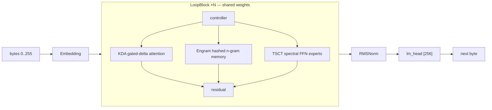

<div align="center">

# 🐹 dormouse

**A byte-level language model that trains on one workstation — with every
claim measured, and every retraction kept.**

[](https://github.com/sehaxe/dormouse/actions/workflows/ci.yml)
[](LICENSE)
[](https://www.rust-lang.org)
[](https://developer.nvidia.com/cuda-gpus)
[](https://github.com/burn-rs/burn)

Rust · burn + cubecl · one RTX 5060 Ti (16 GB, sm_120) · 6 workspace crates +
a 20-crate vendored kernel library

</div>

---

## What is this

dormouse trains a byte-level LM (vocab 256) whose depth is a **weight-shared
loop**: one block, run N times with a controller blending attention, memory
and FFN arms — the PonderNet idea, minus the parts that failed measurement.
The mission is efficiency per FLOP/byte on a single 16 GB GPU with 64 GB of
host RAM: hashed n-gram memory as input features, low-rank spectral (TSCT)
FFN experts, precision spent only where numerics demand it, and an n-gram
memory that offloads to RAM without latency.

The project is **evidence-first**: every mechanism must beat its own removal
on held-out loss at a fixed budget (`A/B or death`), every measured number is
published with its config and date, and every retracted claim stays published
as retracted. The full rulebook lives in [`AGENTS.md`](AGENTS.md).



## Results

Held-out BPB (bits per byte) — lower is better. **A BPB is only comparable
within its eval window**, so every number carries its window.

| model | held-out BPB | window | note |
|---|---|---|---|
| uniform byte | 8.000 | — | by definition |
| unigram counter | ~5.17–5.40 | — | the first real bar |
| **dormouse, best clean run** | **4.997** | 20 480 B | depth 2, no attention arm in training (`--no-kda`), step 6500 |
| **dormouse, 100k official run** | **5.615 best** | 81 920 B | depth 4, full arms, `--retract-every 4` |
| 5-gram + backoff | **~2.57** | — | **the bar. Not beaten yet** |

**The first A/B verdict in the project's history** (2026-10-01): the JEPA+KoLeo
auxiliary heads beat pure CE **3 seeds out of 3** with full separation
(6.343 vs 6.425 mean held-out BPB, 2k steps) — `d8062d1`. Everything else is
implemented, gated, and waiting for its verdict: MHC, SiTU-GLU, RoPE-in-KDA,
MoE, AttnRes, future-byte — 19 instrumented arms, all OFF by default.

Full evidence tables, retraction history and the open-blockers ledger:
[`AGENTS.md` §3](AGENTS.md) · raw rows in [`benches/history.tsv`](benches/history.tsv).

## Quick start

```bash
# build all three binaries (train, generate, serve)
cargo build --release

# tests (CPU; no GPU needed)
cargo test -p dormouse-core -p dormouse-data -p dormouse-train --lib

# a real run — one command, checkpoint name derived from the flags
tools/first_run.sh --preset small --batch 8 --seq-len 512 --steps 2000

# every knob is a typed flag
./target/release/train --help

# turn a checkpoint into a standalone inference file, then generate
./target/release/export --ckpt-name <name>
./target/release/generate --ckpt-name <name> --prompt "Once upon a time"
```

Presets are flat TOML in [`configs/`](configs) (`nano` → `small` → `base`;
`cargo test -p dormouse-core --test preset_exec` asserts their param counts).
The GPU binary needs the `cuda` feature (default) and an sm_120 card;
everything else runs on CPU/ndarray.

## Architecture

Four steps in [`crates/dormouse-core/src/model.rs`](crates/dormouse-core/src/model.rs):

1. **Embedding** `[256, d_model]` — the only place a byte becomes a vector
2. **LoopBlock** ×N iterations, shared weights: a controller (sigmoid gates +
   softmax expert blend) routes a **KDA gated-delta attention** arm, an
   **Engram** hashed n-gram memory arm (FNV keys, optional host-RAM offload
   with CPU Nesterov+Sinkhorn updates), and N low-rank **TSCT spectral**
   FFN experts, then a residual write (ReZero / Gated-Residual / AttnRes)
3. **RMSNorm** → **lm_head** `[d_model, 256]`
4. Loss: honest unweighted cross-entropy; auxiliary heads (JEPA EMA-teacher,
   DSpark draft, future-byte) are config-gated and A/B'd

The trainer (`dormouse-train`) runs a Muon+ mixed optimizer, TSCT polar
retraction every step, a NaN firewall, deterministic seeding, and checkpoints
in a self-describing `.dmexp` format with a config snapshot that refuses
mismatched resumes.

## The vendored kernel library

[`vendor/burn-fused/`](vendor/burn-fused) is our own 20-crate technology
library — KDA, Engram, spectral/TSCT, Muon+, RMSNorm, JEPA, DSpark, BitNet,
RoPE, MHC, SiTU and more — each crate with its paper reference and a
verification tier ([`docs/protocols/ORACLE-TIERS.tsv`](docs/protocols/ORACLE-TIERS.tsv)). The repo
also vendors patched forks of five cubecl/cubek crates (the root
`Cargo.toml` `[patch.crates-io]` is the authority).

## Documentation

**Every document lives under [`docs/`](docs/),** one directory per kind, one
naming rule — [`docs/README.md`](docs/README.md) is the map and the only page
you need to find anything. The repo root keeps four files: this one,
[`AGENTS.md`](AGENTS.md) (the rulebook: how to work here, machine facts,
measured status, retractions — read §1 before your first edit),
[`CONTEXT.md`](CONTEXT.md) (the system map) and
[`CONTRIBUTING.md`](CONTRIBUTING.md) (how to work here in practice).

| document | what it is |
|---|---|
| [`docs/README.md`](docs/README.md) | **the map** — which directory a new document belongs in |
| [`docs/glossary.md`](docs/glossary.md) | one term, one meaning (+ the list of doc-vs-code disagreements) |
| [`docs/adr/`](docs/adr) | architecture decision records |
| [`docs/protocols/`](docs/protocols) | A/B protocol, oracle tiers, verification rules |
| [`docs/papers/`](docs/papers) | original papers this project builds on, with provenance |
| [knowledge base site](docs-site/) | Starlight site over all of the above — `cd docs-site && npm run dev` |
| [`benches/history.tsv`](benches/history.tsv) | every measurement ever taken, with config+date |

## Contributing

[`CONTRIBUTING.md`](CONTRIBUTING.md) is the entry point: which command answers
which question, the worktree and build-lock rules, and the four rules that have
already cost a run. [`AGENTS.md`](AGENTS.md) §1 is the rulebook it defers to —
loud failures, A/B or death, zero host-device sync, one claim one evidence.

## License

MIT — see [`LICENSE`](LICENSE). The vendored forks keep their upstream
MIT/Apache-2.0 notices.
