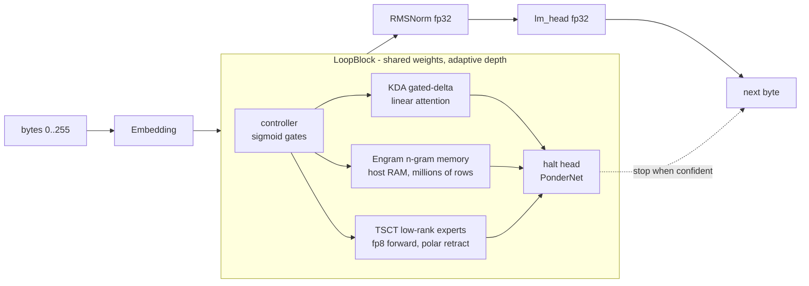

<div align="center">

# 🐹 dormouse

**Maximum capability per gigabyte — a byte-level LM trainer for one workstation.**

[](https://github.com/sehaxe/dormouse/actions/workflows/ci.yml)
[](LICENSE)
[](https://www.rust-lang.org)
[](https://developer.nvidia.com/cuda-gpus)
[](https://github.com/burn-rs/burn)

*Rust · burn + cubecl · one RTX 5060 Ti (16 GB) + 64 GB host RAM · 15.5k lines, every one held by a verdict*

</div>

---

dormouse trains byte-level language models with the biggest possible brain per
gigabyte: n-gram memory lives in host RAM by the billion of rows, adaptive
compute decides per sequence how deep to think, and precision is spent only
where numerics demand it. The end goal is a model that can code — and code its
own updates, merged only through the verification harness.

## Table of contents

- [Architecture](#architecture)
- [The doctrine](#the-doctrine)
- [Presets](#presets)
- [Quick start](#quick-start)
- [Data pipeline](#data-pipeline)
- [Performance](#performance)
- [Status & roadmap](#status--roadmap)
- [Docs](#docs)
- [License](#license)

## Architecture

One shared `LoopBlock`, run up to `max_iter` times per sequence (PonderNet
halting decides how deep to think):



- **Engram memory** — FNV-hashed n-gram tables live in host RAM at millions of
  rows; only the current batch's rows (~600 KB) touch the GPU per step.
- **Spectral experts** — low-rank TSCT layers: fp32 masters, fp8 forward on
  sm_120, per-step polar retraction with a one-way fp32 fallback on drift.
- **Precision per component** — fp32 only where correctness demands it (GEMM
  accumulate, logits, gates, masters); bf16/int8/fp4 where a measured A/B says
  the bytes are wasted.
- **Optimizer** — Muon+ (ColRow, routing-validated) on 2D matrices, AdamW on
  embeddings/heads/1D, Adan as the fallback group.
- **Aux heads** (configurable) — JEPA masked-latent vs an EMA teacher + KoLeo,
  and a DSpark draft head for next-K prediction.

## The doctrine

1. **A/B or death** — every mechanism beats its own removal on held-out BPB at
   a fixed step budget, or it is deleted. Ties delete. The same audit applies
   to source lines: each one is held by a recorded verdict.
2. **Loud failures** — data that does not exist stops the run, it is never
   synthesized (a silent filler once trained a model on constant bytes for 500
   steps); shape mismatches assert; assertions average ≥2 per non-trivial
   function (NASA P10 Rule 5); `--guard` is the recovery action.
3. **The bench gate is alive** — `benches/history.tsv` accumulates one row per
   benchmark; a regression against the previous row blocks the merge. Verdicts
   are rows, not prose.
4. **One heavy thing at a time** — ram-guard service, MemoryMax cgroup caps,
   slot caps, persistent logs. Learned from three full-system freezes.

## Presets

Flat TOML in [`configs/`](configs/) — presets are data, not code.

| preset | d_model | experts | max_iter | target |
|---|---|---|---|---|
| `nano` | 512 | 3 | 4 | smoke tests |
| `small` | 768 | 3 | 4 | **flagship on 16 GB** (7.53M params) |
| `swift50` | 1024 | 8 | 8 | 50M-class experiments |
| `base` | 1024 | 3 | 8 | 12.2M params |
| `one_b` | 2048 | 4 | 12 | the 1B dream |
| `p150` | 4096 | 4 | 12 | 159.7M params |

## Quick start

CUDA GPU required (developed on sm_120). The build pulls patched forks from
`vendor/` — nothing works without them.

```sh
git clone https://github.com/sehaxe/dormouse && cd dormouse
cargo build-train                                    # release CUDA binary

# train (all knobs are typed flags: --help)
./target/release/train --data <corpus-dir> --preset small \
  --ckpt-name latest --ckpt-dir checkpoints \
  --eval <held-out-dir> --eval-every 500 \
  --engram-ram --engram-slots 8000000 --guard --detach

# generate + serve from the same checkpoint pair
./target/release/generate --ckpt-name latest --ckpt-dir checkpoints --prompt "once"
./target/release/serve   --ckpt-name latest --ckpt-dir checkpoints

# the regression gate: one row per run, compare before merging
./scripts/bench.sh canary
```

Long runs survive: `--guard` re-execs on NaN/panic with a fresh CUDA context
and resumes from the last checkpoint; `--detach` daemonizes in-process with
`--log <file>`.

## Data pipeline

Streams bytes (text, parquet, images, binaries — a JPEG is just bytes to
predict) through a 64 MB ring refilled in 8 MB chunks, seeded Fisher-Yates
shuffled, split deterministically. `bin/filter.rs` is a DCLM-style corpus
filter with a **two-region mode**: the eval tail is excluded from training
data at filter time — straddler documents dropped, dedup shared — so held-out
BPB measures generalization, never memorization (ADR-0010). A corrupt or
missing corpus stops the run loudly; data is never synthesized.

## Performance

One GPU, one honest gate:

| date | commit | mode | step | throughput | final CE |
|---|---|---|---|---|---|
| 2026-09-25 | bdddbaf | canary (2M slots, aux off) | 4081 ms | 1.23 KB/s | 5.141 |

Every optimization lands by beating the previous row at equal or better BPB —
fused-kernel rungs, the fusion backend, the bf16/int8 diets — or it is
deleted. Full history: [`benches/history.tsv`](benches/history.tsv).

## Status & roadmap

**On `main` (2026-09-26):** burn/cubecl 0.22.0-pre.4 with a slot-preserving
memory-pool fix vendored; MSA disabled pending a kernel rewrite + won A/B
(ADR-0012); corpus v2 with leak-free eval; loud-failure data pipeline; the
config seam with snapshot + drift check.

Next, in order:

- [ ] flip the fusion backend, A/B against the canary row
- [ ] fused-kernel rungs: direct adjoints from saved buffers, autotuned
      matmuls; kill switch at parity (ADR-0009)
- [ ] the official 100k-step baseline on corpus v2
- [ ] knife A/Bs: aux heads vs pure CE, GR vs ReZero, rank 64 vs 32
- [ ] bf16/int8 diets for the host-RAM tables
- [ ] code-domain corpus mixture → SFT → RLVR self-evolve loop
      ([`POST_TRAINING.md`](POST_TRAINING.md))

## Docs

| doc | what |
|---|---|
| [`AGENTS.md`](AGENTS.md) | agent-facing repo state: measured numbers, GPU quirks, knobs |
| [`docs/PLAN.md`](docs/PLAN.md) | program plan, phase ladder, verdicts, north star |
| [`docs/adr/`](docs/adr/) | ADR-0001..0012 — every recorded decision |
| [`docs/audit-2026-09-25.md`](docs/audit-2026-09-25.md) | the codebase verdict audit: kill list, P10 violations, missing A/Bs |
| [`docs/design-minimal.md`](docs/design-minimal.md) | the minimal-architecture target (~-60% LOC, zero loss) |
| [`research/2026-09-25-fused-rewrite-plan.md`](research/2026-09-25-fused-rewrite-plan.md) | why fused was slow, the rewrite rungs |
| [`POST_TRAINING.md`](POST_TRAINING.md) | post-training loop (in Russian) |

## License

[MIT](LICENSE) © 2026 sehaxe
