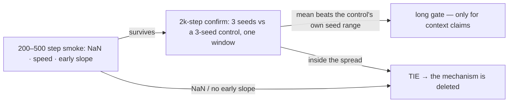

# A/B testing: how an arm is judged here

> Updated 2026-10-01. Sources: `docs/protocols/AB-PROTOCOL.md` (the
> instrument, corrected 2026-09-28, with the 2026-09-30 hygiene additions),
> `AGENTS.md` §1.2 and §3.4, `docs/reviews/ab-wave-2026-10-01.md` (the control
> family and the first wave verdicts), `benches/history.tsv` (every number
> with its config+date), and `docs/guides/determinism.md` for the seed
> precondition. Where a source's demand has been superseded by a later
> measurement, both are shown — that is a feature of this repo.

The rule is one sentence: **every mechanism must beat its own removal on
held-out BPB at a fixed step budget, or it is deleted. A tie deletes the
mechanism** (`AGENTS.md` §1.2, ADR-0002). There is no "keep it because it
might help later". This page makes the rule executable: the ladder, the
yardstick, the checks that keep a number honest, and the two verdicts that
exist so far.

## The ladder

`AGENTS.md` §1.2: a 200–500 step smoke (NaN, speed, early slope) as a filter →
a 2k+ step confirm for survivors → a long gate only for context claims. At
this project's scale the statistical requirement is **3 seeds per arm**, same
data order, because seed variance exceeds every recipe difference measured
(the independent 151M study the protocol cites found seed variance larger than
every recipe difference it measured — `docs/protocols/AB-PROTOCOL.md`, "The
statistical requirement"). Why 3 seeds is now *possible* rather than merely
demanded: [determinism.md](determinism.md).

## Why the naive version failed — three instrument bugs

The protocol says it plainly: *"No arm in this queue has been judged, and the
instrument itself was broken when the queue was written"*
(`docs/protocols/AB-PROTOCOL.md` header). Three bugs, each fixed, each of
which defines a check you still run today:

1. **The attention arm had no gradient** (`8fa5d4c`): the hand-rolled
   autodiff node was a leaf under `BalancedCheckpointing`, so every control on
   record was a network with attention frozen at initialisation. The log said
   so: `~/logs/train_kda_full.log` printed `fused kda=3126/0` — 3 126
   forwards, zero backwards. *Resolved in history*: the gradient test
   (`d8fa449`, `tests/kda_param_grads_cuda.rs`) proved all 11 KDA parameter
   groups receive non-zero finite gradients on the trainer's backend
   (`AGENTS.md` §3.3).
2. **The eval threw the n-gram keys away** (`7adda92`): it passed
   `hashed_ids = None` unconditionally, so on the in-VRAM Engram path the
   held-out number came from a network with **no memory in it**. The
   "Engram lost by 1.46 BPB" comparison (6.453 vs 4.997) was a memory-enabled
   run scored by a memory-disabled evaluation of itself — not a verdict, and
   never one. The fix added `engram=<rows>/<arms>` to the eval line:
   `engram=0/<n>` means the eval ran a memory-disabled forward
   (`AGENTS.md` §3.2).
3. **The window was not a constant.** "100 KB per eval" was the batch-10
   shape quoted as a property of the eval; the batch-2 ablations scored
   20 480 B — a 5× smaller window from a throughput flag
   (`docs/protocols/AB-PROTOCOL.md`, "The measurement instrument"). The
   formula and the consequence are below.

A fourth, quieter cost of that era: every step-time reading taken alongside
those runs was read at step 0 and wrong by up to 23× — see "What is not an
A/B" below.

## The window: a BPB is only comparable within one window

The eval window is **`eval_batches × batch × seq_len` bytes**
(`crates/dormouse-train/src/lib.rs:1417`), `rewind()` before every eval, and
**the byte count printed on the eval line is the authority** — quote it in any
table. The concrete damage: the best number on record, **4.997**, is a
**20 480 B** window at depth 2; the **6.351** is a **102 400 B** window at
depth 4 — not two points on one curve, two different measurements, and no run
in the archive has been scored on both (`docs/protocols/AB-PROTOCOL.md`). The
current control family and every arm in the 2026-10-01 wave share **81 920 B**
(20 batches × batch 8 × seq 512), and every one of them is batch 8
(`docs/reviews/ab-wave-2026-10-01.md:8-11`). If an A/B table has one arm at a
different batch size from its control, **the table is void regardless of what
the numbers say**.

## The yardstick: a 3-seed control and its own spread

The control family, exactly (`docs/reviews/ab-wave-2026-10-01.md` §0.1) —
seven night logs, two families, aux-ON and pure-CE:

| log | aux | seed | BEST HELD-OUT bpb |
|---|---|---|---|
| `first_run_2000_0930_1855` | ON (jepa 0.05) | 1 | **6.387** |
| `first_run_2000_1001_0037` (`--seed 2`) | ON | 2 | **6.314** |
| `first_run_2000_1001_0057` (`--seed 3`) | ON | 3 | **6.329** |
| `first_run_2000_0930_1921` | OFF | 1 | 6.437 |
| `first_run_2000_1001_0121` | OFF | 2 | 6.443 |
| `first_run_2000_1001_0147` | OFF | 3 | 6.396 |
| `first_run_2000_0930_1940` (`--retract-every 4`) | ON | 1 | 6.329 |

The **aux-ON 3-seed control** is the yardstick: mean **6.3433**, sample sd
0.0386, **range 0.0730** — and §1.2's bar is the control's own seed *range*:
a win has to beat 0.0730, not beat its own sd. Two traps the wave report
caught in its own brief:

- **Pooling the families is wrong.** The brief's "control mean ≈ 6.37, spread
  ≈ 0.06" was the mean and sd of all seven logs pooled — two different
  recipes averaged together. A number about a union is not a yardstick
  (`docs/reviews/ab-wave-2026-10-01.md` §0.1).
- **The seeds are 1/2/3.** `first_run_2000_1001_0037` is a *date* (Oct 01,
  00:37), not a seed 1001 — the log filename pattern is
  `first_run_${STEPS}_$(date +%m%d_%H%M).log` (§0.2). And the wave runs the
  *same* seeds 1/2/3 as the control on purpose: paired same-seed runs start
  from the same initialisation to within the TSCT residue (≤1.04e-06,
  [determinism.md](determinism.md)), which removes the init term from the
  comparison.

The control's recipe, read off its config snapshot: `--preset small --batch 8
--seq-len 512 --no-engram --steps 2000 --eval-every 500 --detach
--timers`, aux at preset defaults (jepa 0.05 + KoLeo, dspark 0.0),
`eval_batches 20`, `lr 1e-4 cosine`, `opt mix` (Muon+ ns=8), quant auto → Fp8,
`max_iter 4`, 9 197 454 params (`docs/reviews/ab-wave-2026-10-01.md` §0.3).

One confound named rather than hidden: the 3-seed control family ran
`retract_every 1`, the wave ran `retract_every 4` (the owner's working mode).
The cadence effect is measured at one seed only: 6.387 (retract 1) vs 6.329
(retract 4), a paired −0.058. Until two retract-4 control seeds close it,
every wave verdict carries a ±0.05-ish systematic on top of the 0.0730 seed
range (§0.3, §7.2).

## Reading a result: the two verdicts that exist

**The rule** (`docs/protocols/AB-PROTOCOL.md`): an arm wins if its mean
held-out BPB at the same step count is below the control's mean by more than
the spread across the control's own 3 seeds. Anything inside that spread is
"no difference".

**Verdict 1 — the JEPA+KoLeo aux heads beat pure CE, 3/3 seeds with full
separation** (`d8062d1`, 2026-10-01): control 6.387/6.314/6.329 mean **6.343**
vs pure-CE 6.437/6.443/6.396 mean **6.425** (`benches/history.tsv`,
`control-3seed` and `a0-pure-CE-3seed` rows). This is the first A/B verdict in
the project's history, and it reversed a researcher recommendation by data:
the JEPA weight-0 recommendation was reversed because the aux arms earned
their place (`benches/history.tsv:142`).

**Verdict 2 — mHC is a TIE, and a tie deletes** (`docs/reviews/ab-wave-2026-10-01.md`
§6.3): 6.413/6.313/6.370, mean **6.3653** (sd 0.0502, range 0.100) vs the
control's 6.3433. Paired same-seed deltas +0.026 / −0.001 / +0.041; mean delta
**+0.0220 against a bar of 0.0730** — inside the control's own seed spread.
What makes the tie a *measurement* and not a no-op: the arm engaged —
`params=9203609` against the control's `9197454`, i.e. **+6 155 params
(+0.067 %)**, exactly the cost the mHC report quoted. §1.2 says a tie deletes
the mechanism; `mhc_streams = 4` (the base paper's own rung) remains the one
follow-up this result says nothing about.

## Make sure the arm ran before you read the number

- **`params=` on the header line** is the cheapest engagement check — see
  [train-your-first.md](train-your-first.md). It caught mHC's +0.067 %.
- **Counters on the eval line** (`fb=<ran>/<asked>` for future-byte;
  `engram=`, the legacy seams). Gaps exist and are recorded, not smoothed:
  `probe.rs` counts `MHC`, `SITU`, `MOE_ROUTE` and `ATTNRES`, but **none of
  those four reaches the log line** (`crates/dormouse-train/src/lib.rs:1635`)
  — for four of five arms the log cannot show the arm ran, which is a §1.1
  SILENT gap listed as owed (`docs/reviews/ab-wave-2026-10-01.md` §7.1).
- **`--set` is a hand-written `match` over 33 keys**
  (`crates/dormouse-core/src/config/override.rs:28-71`), not a generic
  override: `--set use_mhc=true` died in 32 seconds with `unknown config key`,
  and four documented arm invocations had **never reached a trainer**. The
  reachable seam is a preset file — `configs/small.toml` plus the arm line(s),
  verified by `diff` (§6.1–6.2). When an arm refuses to run, record the
  refusal loudly and skip it; do not debug it mid-wave.

## What is *not* an A/B

From `docs/protocols/AB-PROTOCOL.md` "What is NOT an A/B", each earned by a
real failure:

- **A step time with no step index.** Step 0 was 5 549 ms against a warm
  ~245 ms in the same configuration — 23× — because the cubecl autotune cache
  is cold. This file's own history produced `25858 ms`, `10809 ms` and
  `1.58–1.84 s/step` in sequence; all three are struck
  (`benches/history.tsv`, the 2026-09-28/29 retraction blocks). A step-time
  claim needs three things: same shape (`--timers`), a quiet GPU, and a step
  index past 50.
- **A BPB from two different windows.** 4.997 (20 480 B) vs 6.351 (102 400 B)
  is not a comparison (above).
- **Two GPU processes at once.** It corrupted the cubecl pool, which wrote
  garbage weights into a checkpoint and killed a run — 2026-09-27,
  `official_v5`, three wasted resumes. The ram-guard stops a runaway; it does
  not stop two legal processes from colliding.
- **The 2026-09-27 `--no-kda` 956 → 188 ms ablation** — measured alongside a
  live run, so a ratio, not an absolute; and the arm was not training at the
  time, so it prices neither the arm as it was nor as it is.

## What a run costs: the honest answer is "unknown, here are floors"

The protocol's original budget — 2 000 steps at ~1.6 s/step = 53 min/run,
2.7 GPU-h per arm — is **struck**: the 1.6 s/step came from a run whose
attention backward executed zero times. The 25.8 s/step that would replace it
is struck too: no committed log, no `benches/history.tsv` row, conditions
nobody can reproduce (`docs/protocols/AB-PROTOCOL.md`, "The cost of one arm is
currently UNKNOWN"; `benches/history.tsv` strike block). A single
unreproduced observation is not a budget.

What *is* measured, 2026-09-29, warm, release, `small` depth 2 fp32 aux off
`--no-engram` — every one a **floor**, because the attention backward does not
run in any of them:

| batch | warm step | 2000 steps |
|---|---|---|
| 8 | 244 ms | ~8 min |
| 16 | 440 ms | ~15 min |
| 32 | 826 ms | ~28 min |

And one partial data point at the queue's own shape: `tools/mor_ab.sh
preflight` (2026-09-29, `small`+`mor`, batch 20 × seq 512, fp32, pure CE)
measured a steady **1068 ms** step — a 2k-step arm ≈ 36 min, a 3-seed × 2-arm
sweep ≈ **3.6 GPU-h**. That run also printed `fused kda=64/0` in *both* arms,
so it too is a floor — and it says cost is not what blocks the queue
(`docs/protocols/AB-PROTOCOL.md`). To price a row honestly: one step with
`--timers` on a quiet GPU at the intended batch, at a step index past 50, and
a row in `benches/history.tsv` before planning anything on it.

## The queue, its preconditions, and its hygiene

The queue with flags and what each arm decides is
[`docs/protocols/AB-PROTOCOL.md`](../protocols/AB-PROTOCOL.md) §"The queue":
control → pure CE → dense FFN → working set → rand depth → depth 2 vs 4 (the
cheapest big lever) → KDA decay form → hashed memory → the capacity ladder →
AttnRes → RoPE-on-KDA (the one row that is a post-training gate, not a BPB
race) → SiTU-GLU. Two preconditions before *any* row: the seed gap closed on
the backend the arm runs on (**closed 2026-09-30**,
[determinism.md](determinism.md)), and a control with a gradient-carrying
attention arm (**exists** — the family above).

The 2026-09-30 hygiene block at the end of the protocol
(§"Гигиена прогонов", kept in Russian there, binding as written) adds: a
`history.tsv` row must carry commit/config, seed, the fixed validation split,
bytes actually processed, updates, GPU time, validation BPB, invalid-UTF-8
share; equal step counts are not matched-compute (aux changes the price of a
step); the queue is strictly single-factor — CE → CE + fixed aux → CE +
attnres, never two changes at once; the future-leak check comes *before*
aux runs (loss as a function of future target bytes must be identically
zero-gradient); and 2 000 steps is the quotable smoke for this window, not a
final rating.

## The noise floor under everything

The paired-eval resolution on a fixed window is **estimated at 0.002–0.005
BPB and NOT VERIFIED** — measure it before believing a win that small:
evaluate the *same* checkpoint twice at the same depth and confirm the numbers
are bit-identical, then run two control seeds before believing any win smaller
than their spread; and fix the window first, because "the same checkpoint
twice" is only a resolution measurement if the byte count on both eval lines
is identical (`docs/protocols/AB-PROTOCOL.md`, "Measure the noise floor
first"). The real floor is the training seed — which is exactly why the
protocol is 3 seeds, a control family, and a bar made of the control's own
spread.
