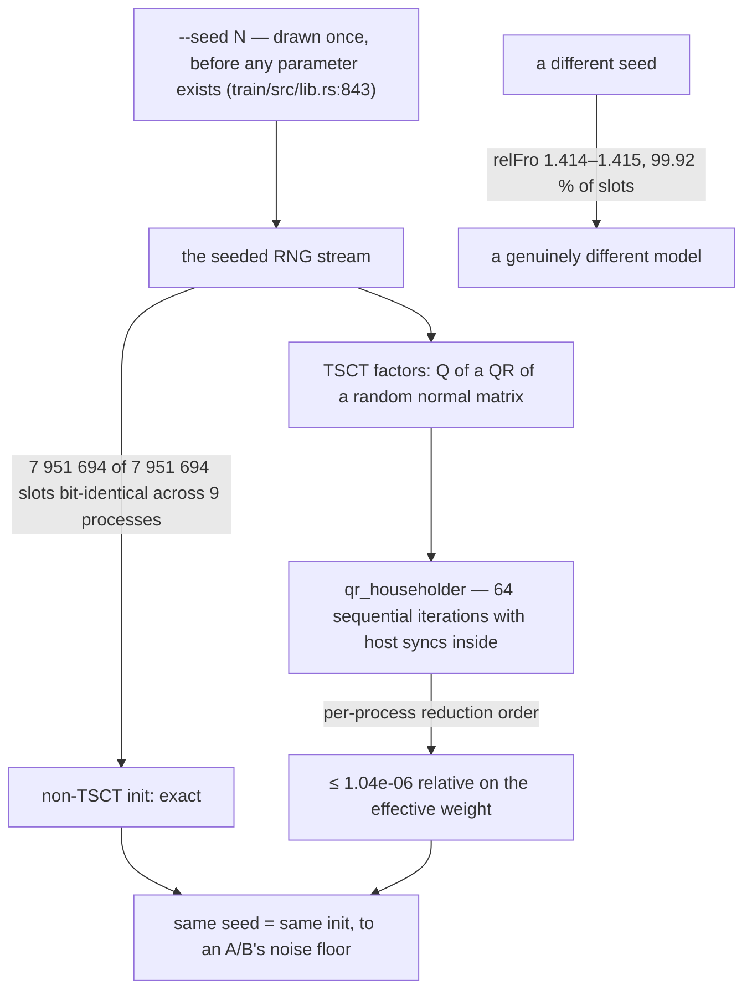

# Determinism: why `--seed` was the easy part

> Updated 2026-10-01. Sources: `docs/protocols/determinism.md` (the
> tensor-level lane, 2026-09-30), `AGENTS.md` §3.7 (the `--seed` block, with
> its correction and withdrawal history), `docs/protocols/AB-PROTOCOL.md`
> ("The statistical requirement", with the superseded slot-count table),
> `docs/reviews/ab-wave-2026-10-01.md` §0.2, `tools/determinism.py` (its own
> header is the instrument's contract), and `tools/determinism/` (the
> analysis scripts). Every number names its source; the superseded readings
> are kept because they are the reason the current ones exist.

The protocol needs three seeds per arm (`AGENTS.md` §1.2, ADR-0002). That
requirement contains a hidden premise: **two runs under one seed are the same
run.** This page is the story of how that premise was broken, measured,
re-broken, and finally proven on this box — and of the one place where it is
still only approximately true.



## Act 1 — the seed never reached the model

Until 2026-09-28 (`4b42b6d`), `device.seed(cfg.seed)` reached only the JEPA
span mask. The model was never seeded: two runs with identical flags and zero
steps produced checkpoints differing in **34 730 605 of 43 725 616 bytes**
(`AGENTS.md` §3.7, `--seed` block). Every A/B in the archive compared two
different initialisations and charged the difference to the arm, and "3 seeds
per arm" was not implementable — all three seeds produced different
initialisations regardless.

The fix wired the seed into model init, before any parameter exists
(`crates/dormouse-train/src/lib.rs:843`). What it did *not* do was make runs
reproducible by itself — which is what the next act is about.

## Act 2 — two instruments that measured themselves

The first post-fix readings compared **checkpoint files**, and produced a
table that could not be true: three zero-step runs of one binary, same flags,
`--seed 7`, compared as raw f32 slots:

| pair | differing slots (of 18 398 028) | % |
|---|---|---|
| A vs B | 30 682 | 0.167 % |
| A vs C | 2 299 790 | 12.50 % |
| B vs C | 2 301 566 | 12.51 % |

(`docs/protocols/AB-PROTOCOL.md`, "The statistical requirement".) The
differing sets of A/B and A/C overlapped at Jaccard 0.012 — essentially
disjoint, which no fixed uninitialised region can explain — and the magnitudes
ran from median |delta| 3.4e-8 to **max 2.07e+38**. Every number in that table
was struck: the denominator was wrong (the file holds the optimizer record,
the EMA teacher and 1 586 slots of inter-tensor padding — the model record is
9 197 390 named slots, `docs/protocols/determinism.md` §0), the *count* of
differing slots is not a distance (an f32 whose last bit moved counts the same
as one that moved by 1.0), and the parser read tensor offsets from base 0.

The padding deserves its own sentence, because it is the subtle half: **the
absurd slots are real file bytes** — 244–252 per run of `|v| ≥ 1e30`, every
one of them in the padding *between* tensors, zero inside a named tensor,
positions moving run to run because the padding is whatever the allocator left
there (`docs/protocols/determinism.md` §0 and §5). A parser is needed not to
fix the numbers but to *not count* bytes that are genuinely in the file.

In the same window, a stronger claim was withdrawn too: "CPU is deterministic"
rested on a test that built the model twice and compared. `Device::seed()` does
not rewind a consumed stream — two fresh devices both seeded 7 draw the same
bytes, but re-seeding to 7 after the stream has been consumed does not return
to the start — and `Device::flex()` hands back a **shared** device, so the
second build was never a same-seed build: 36 of 54 parameters differed, first
at `embedding.weight`, and the test went from green to all-65 536-logits-
differing overnight with no framework change in between (`AGENTS.md` §3.7).
The lesson generalises: **a determinism claim has to be cross-process, or it
is not measuring determinism.**

## Act 3 — the tensor-level measurement, and what it proved

Two independent instruments (`57237c3`, then `58281c8`..`8da23bb`, the
`wt/determinism3` lane) compared **tensors, not files**, with self-validating
parsers. Bottom line from `docs/protocols/determinism.md`:

- **Same seed, different processes: the init is the same.** All **7 951 694**
  non-TSCT parameter slots bit-identical in every same-seed pair, across
  **9 processes**, gaps 68 s…1304 s. One pair was bit-identical at 860 s
  apart.
- **The only thing that moves is the TSCT factorisation**, at most
  **1.04e-06** relative on the effective weight `U·diag(s)·Vᵀ` (one
  instrument read ≤ 1.24e-08 per-factor), and in one pair not at all.
  Same-seed differences top out at 6.2e-07 — **~5 ULP at magnitude 1**
  (f32 eps 1.192e-07), consistent with a 1-ULP difference random-walking
  through 64 sequential QR iterations (`sqrt(64) ≈ 8×`).
- **A different seed is a different model.** Seed 8 vs seed 7: **7 944 705 of
  7 951 694** non-TSCT slots differ (99.92 %), relFro **1.414–1.415**.
- The separation between "same seed" and "different seed" depends on which
  residue you divide by: **~10⁶** against the effective-weight residue
  (1.415 / 1.04e-06 — `AGENTS.md` §3.7), and the harness quotes **1.1e8×**
  using the per-factor reading (`tools/determinism.py` header). Both are the
  same measurement seen through the two residue numbers above.

**No wall-clock effect survived**: gaps of 100 s to 1214 s all give
0…1.04e-06, alongside a bit-identical pair at 860 s — accumulated machine
state cannot order a bit-identical pair 14 minutes after its twin next to a
1e-6 pair 100 s after its twin (`docs/protocols/determinism.md` §1).
"Back-to-back vs minutes later" was an artifact of the slot-count instrument.

## The cause: one loop, four sync sites

Every TSCT factor is the Q of a QR factorisation of a random normal matrix;
`qr_householder` loops `j in 0..n.min(m)` with `n = rank = 64`, and each
iteration holds full reductions plus **three host syncs** — a
`col.mul(col).sum()`, `into_scalar()` calls feeding a **host-side branch on a
device value**, a `v.mul(v).sum()`, and two `matmul`s
(`docs/protocols/determinism.md` §2; the function is now at
`vendor/dormouse-fused/crates/burn-spectral/src/lib.rs:792` after the
`burn-fused` → `dormouse-fused` rename — `docs/guides/cli.md`, Optimizer
section, names the `:689`-vs-`:792` drift). Four measurements point at that
loop and nowhere else:

1. The RNG stream is provably correct (point above — a desynchronised or
   unseeded stream would corrupt everything after the first divergent draw).
2. Divergence enters at a **random iteration**: the first differing column of
   Q ranges 0…55 (median 2) over six runs, and 139 of 360 tensor-pairs are
   entirely identical. A fixed seed bug or fixed code path would pin it.
3. It is not the `sign` branch: 0 of 64 columns with cosine < −0.9 — the
   difference is a sign-preserving scatter.
4. It is not machine state (the 860 s bit-identical pair).

That the specific trigger is the cubecl autotuner choosing a different kernel
per process is a plausible, consistent **hypothesis** — it was not measured,
and is recorded as such (`docs/protocols/determinism.md` §2, "Confidence").
The sync sites are also an `AGENTS.md` §1.3 violation carried openly: host
syncs and a host branch on a device value, inside a 64-iteration init loop.

## A checkpoint file can never be byte-equal across processes

Even where parameters are bit-identical, the *file* is not: `ParamId` is a
**process-global counter** serialised into the CBOR metadata. Two runs can
share a data-section sha256 — `d3a` and `d3d` both hash to
`46e8998ee8f19ae7ef812f89feabcacf` — while their records differ
(`docs/protocols/determinism.md` §1b). `cmp`, `md5sum`, any byte-level
checkpoint diff are structurally incapable of being zero across processes.
**Compare parameter tensors, never files.** Save→load→save is bit-exact at the
tensor level (`AGENTS.md` §3.7).

## Growth during training — and the honest bound

Same-seed divergence grows once training starts, from the ~1e-6 seed running
with ordinary float chaos. The fastest movers are the small-norm parameters
(`aux.jepa_pred.norm.beta` 4.7e-08 at step 5 → 6.4e-03 at step 20; `iter_embed`
2.2e-04) — monotone float chaos seeded by the 1-ULP QR difference, **not** an
anomaly; the "20-step anomaly" reading was dropped
(`docs/protocols/determinism.md` §4).

The honest bound is **20 steps**: the ladder's 50- and 100-step rows never
ran. Both runs died at step 0 under GPU contention (a fourth agent was on the
card), and their checkpoints are step-0 artifacts — verified from the files
themselves: header step 0, no `m.prev.bin` (a completed save exists at step 0
because `0 % 1000 == 0` fires a periodic save; the final save never ran).
`docs/protocols/determinism.md` §4 carries the table. So:

- "no compounding to 100 steps" is **not established**; there is no data past
  step 20, and the trend in 0…20 is upward.
- Any claim that two same-seed runs produced "the same" weights must quote a
  **step index** — the same rule a step-time claim carries.

This does not threaten the 2k-step A/B, which compares held-out BPB against a
seed-variance bar and not checkpoint equality — but a same-seed cross-process
checkpoint diff carries a ~1e-6 noise floor, and bit-exact checkpoint
equality is available **only within one process**, where it is useless for an
A/B (`docs/protocols/determinism.md` §3).

## The harness

```sh
tools/determinism.py check A/m.bin B/m.bin            # same seed → PASS
tools/determinism.py check A/m.bin B/m.bin --seed-differs   # expect FAIL
tools/determinism.py run --steps 0 --reps 3           # drives the experiment
```

Two numbers, because one of them lies (`tools/determinism.py` header):
**differing slots** is a count — same-seed pairs sit at 4–13 % and the number
is nearly meaningless alone; **relFro** (`‖A−B‖_F / ‖A‖_F`) is the distance
that means something — ~1e-08 same-seed, ~1.4 different-seed. The thresholds
are `REL_FRO_SAME_SEED_MAX = 1e-5` and `REL_FRO_DIFF_SEED_MIN = 1e-1`, with
~1e8× of measured headroom on both sides. The parser is **self-validating**
because a wrong base does not raise: base=0 reads every tensor 1408 floats
early and 53 of 54 tensors still read as plausible f32, so `tensors()` asserts
`max|v| < 1e6` and turns a silent lie into a raise.

The lane's analysis scripts live in `tools/determinism/` (`verdict.py` for all
15 pairs, `entry.py` for the entry-iteration readout, `structure.py`,
`material.py`, `gapcheck.py`, `anomaly.py`, `steps2.py`), and the reproduction
commands are at the end of `docs/protocols/determinism.md`. Runs land in
`/home/sehaxe/cache/determinism/runs/<label>/m.bin`.

## What this buys, and what is still open

**Bought:** "3 seeds per arm" is implementable on this box today
(`AGENTS.md` §1.2; `docs/protocols/determinism.md` §3). The A/B wave uses the
sharper form the proof enables — arm seeds **paired** against control seeds
1/2/3, so a same-seed pair starts from the same initialisation to within the
TSCT residue, which removes the init term from the comparison instead of
adding a second variance source (`docs/reviews/ab-wave-2026-10-01.md` §0.2).

**Banned:** the 0.167 % / 12.50 % / "max 2.07e+38" readings, the 409 043
figure (prose in five files, no test, never), and the "0–4 NaN + ~500 slots at
|v| ≥ 1e30" file observations — all retracted with their instruments
(`AGENTS.md` §3.7; `docs/protocols/AB-PROTOCOL.md` items 3–4).

**Open:** the TSCT init residue and the §1.3 violation share one fix — make
TSCT init deterministic (host-side QR on the already-good CPU path, fixed-order
reductions, or seeding the factors directly instead of QR-ing on device). It
is an owner decision, recorded as follow-up in both
`AGENTS.md` §3.7 and `docs/protocols/determinism.md` §2. Until it lands, a
deterministic TSCT init is the difference between "same to 1e-6" and
"bit-identical", and the compounding rate past step 20 is unmeasured.
