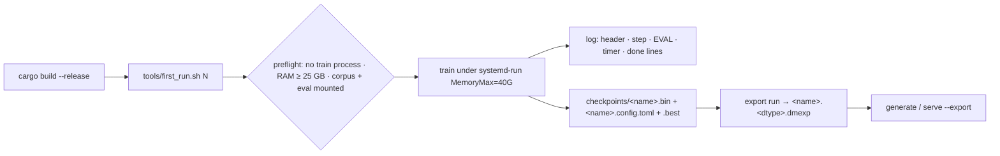

# Train your first model

> Updated 2026-10-01. Sources: [README](../../../README.md) (Quick start),
> `tools/first_run.sh`, `AGENTS.md` §2.4/§2.6/§3.7/§3.8,
> [presets](presets.md) · [every flag](cli.md) · [the .dmexp file](dmexp.md),
> `docs/protocols/AB-PROTOCOL.md`, `docs/reviews/ab-wave-2026-10-01.md`,
> `benches/history.tsv`, and the control-family log
> `~/logs/first_run_2000_0930_1855.log` (2026-09-30) — the run whose lines are
> quoted below. Every number names where it came from; where two sources
> disagree, both are shown with dates.

This page is the whole loop once around: build, one command, what every field
of the log means, how to resume, how to turn the checkpoint into something
that generates text — and what your first number will *not* mean.



## Step 0 — the preconditions

`tools/first_run.sh` refuses loudly (AGENTS §1.1) instead of degrading, and
every check in it exists because breaking it cost a run:

- **No other train process.** One heavy thing at a time, §1.5 — two legal
  processes collided once and the cubecl pool wrote garbage weights into a
  checkpoint (`AGENTS.md` §1.5; the same rule in `tools/first_run.sh:25-27`).
  Builds count toward this too.
- **RAM available ≥ 25 GB** (production wants ≥ 40) — `tools/first_run.sh:28-31`,
  `AGENTS.md` §2.4 item 4. `ram-guard.service` is the backstop that kills the
  heaviest work process under 8 GB free (`AGENTS.md` §2.4 item 1).
- **Corpus and eval mounted.** The real corpus is
  `/mnt/e43497ab-0ff2-45b4-b45f-28de3339a53e/aria_data/pretrain/real/corpus.bin`,
  46.2 GB after the 500 MB eval carve; eval is the sibling `real_eval/`
  500 MB tail carve (`AGENTS.md` §2.6). Pre-carve BPB numbers are not
  comparable — do not substitute a different eval dir
  (`tools/first_run.sh:37-42`).
- **A release binary.** Build under the lock:
  `tools/build_lock.sh run build -- cargo build --release -p dormouse-cli --features dormouse-train/cuda`
  (`tools/first_run.sh:44`). A cold full build is the ≥ 23 min figure in
  `AGENTS.md` §2.5.

The script then `exec`s the trainer under
`systemd-run --user --scope -p MemoryMax=40G` (`tools/first_run.sh:54`) — a
runaway dies at its own cgroup ceiling instead of taking the desktop with it
(`AGENTS.md` §2.4 item 2). Logs go to `/home/sehaxe/logs/`, never `/tmp`
(a 32 GB tmpfs that silently ate a 33.5 GB sidecar once, `AGENTS.md` §2.4
item 5).

## Step 1 — the command

```bash
tools/first_run.sh 500     # smoke: is everything wired, 0 NaN, early slope
tools/first_run.sh 2000    # the control shape every A/B compares against
```

`500` / `2000` are step budgets; anything extra after the number is passed
through to `train` as additional flags (`tools/first_run.sh:21-23`). The
checkpoint name is derived from the flags, which is how the control family got
names like `first_run_2000--retract-every-4-` (`tools/first_run.sh:48`, and
`docs/reviews/ab-wave-2026-10-01.md:75-79` for why the trailing `-` is a
newline).

What the script fixes, and why: `--preset small` (the flagship on 16 GB and
the schema default — [presets](presets.md)), `--batch 8 --seq-len 512`,
`--no-engram`, `--eval-every 500`, `--detach --timers --log`. The
control family every current verdict rests on is exactly this recipe plus a
seed (`docs/reviews/ab-wave-2026-10-01.md:68-79`). `--no-engram` keeps the
first run on the pure-model path: the hashed-memory arm has its own eval
requirements (`engram=` on the eval line, §3.2 of `AGENTS.md`) and its own
footprint, and you want neither in your first hour. The full flag table is
[cli.md](cli.md); the launch line behind the script is `AGENTS.md` §3.8's
flagship recipe minus the Engram offload.

## Step 2 — reading the header lines

Real lines from `~/logs/first_run_2000_0930_1855.log`:

```
dormouse pretrain small params=9197454 steps=2000 data="/mnt/..." lr=0.0001 backend=Device<Autodiff { device: Cube(Cuda(Cuda(0))), checkpointing: Disabled }>
quant format: Fp8 (8 bits)
optimizer: Muon+ ColRow ns=8 + head-wise Muon q/k + Adam wd0 (tables) + AdamW (rest) [muon=15 qk=2 tables=1 rest=36]
```

- **`params=`** is the model you are actually training, measured at
  instantiation — `small` is 9 197 454
  (`docs/guides/presets.md`, measured table). It is also the cheapest
  engagement check there is: when the mHC arm ran, the header moved to
  `params=9203609` — +6 155 params = +0.067 %, exactly the cost its report
  quoted (`docs/reviews/ab-wave-2026-10-01.md:471-475`). If a header does not
  move, the arm did not run, whatever the flags said.
- **`quant format: Fp8`** is `--quant` on auto: sm ≥ 120 → `Fp8`, forward path
  only, fp32 masters — checkpoints stay format-agnostic (`AGENTS.md` §3.7).
  `DM_QUANT_DEBUG=1` prints every `LinearLike` format, debug-only
  (`AGENTS.md` §3.7).
- **`optimizer:`** is the mixed Muon+ policy with its group counts. The live
  policy is the path-marker implementation in `crates/dormouse-train/src/optim.rs`
  (`AGENTS.md` repo layout — say which routing you mean; there is only one now).

## Step 3 — reading the step line

```
step   1900 ce=2.815 bpb=4.061 best=2.676 lr=1.25e-5 aux=0.0358 retr_arm=batched:0/factor:1901
```

- **`ce`** is the training cross-entropy — the honest, unweighted mean, the
  only objective the optimizer steps on (the PonderNet KL term is deleted,
  ADR-0013). **`bpb`** beside it is the same number in bits-per-byte (CE ÷
  ln 2); the *held-out* number lives only on EVAL lines.
- **`best`** is the best CE seen so far; the final line points the `.best.bin`
  checkpoint at it.
- **`lr=1.25e-5`** — cosine decay from `--lr 1e-4` (`docs/guides/cli.md`).
- **`aux=`** is the auxiliary-objective value on log steps. By default the
  JEPA EMA-teacher head (+KoLeo) is on at 0.05 and DSpark is off: `small`'s
  `dspark_weight = 0.0`, and **DSpark is 0 in all eight presets**
  (`docs/guides/presets.md`). Aux is not free — the JEPA teacher is a second
  full forward, which is why `base` OOMs a 16 GB card at batch 6
  (`AGENTS.md` §3.1, VRAM-validated row). Whether aux earns that is no longer
  an open question: JEPA+KoLeo beat pure CE 3 seeds out of 3
  (`d8062d1`, mean 6.343 vs 6.425 held-out BPB — `docs/guides/cli.md` and
  `benches/history.tsv`).
- **`retr_arm=`** is the TSCT retraction split. `--retract-batched` groups the
  per-factor Newton-Schulz by shape — same numbers, fewer launches — and the
  field is printed *either way* because the flag is in the config snapshot
  even though it changes no number: a resume cannot silently switch arms
  (`docs/guides/cli.md`, TSCT section, ADR-0019 rationale). The retraction is
  a fixed per-step cost that does not amortise: 52.8/53.3/64.6 ms at batch
  8/16/32 against step times growing 244 → 826 ms (`AGENTS.md` §3.1).

## Step 4 — reading the EVAL line

```
step    500 EVAL ce=4.449 bpb=6.418 BEST over 81920 B (fixed window) fused kda=2012/0 asked=4096 bwd=0 declined=10276 ops=4096 node_bwd=0 norm=0/4619 muon_skipped=0/0 engram=0/0
```

- **`over 81920 B (fixed window)`** — quote this number in any table. The
  window is `eval_batches × batch × seq_len` bytes
  (`crates/dormouse-train/src/lib.rs:1417`): 20 × 8 × 512 = 81 920 B for the
  batch-8 recipe (`docs/reviews/ab-wave-2026-10-01.md:8-10`), 102 400 B at
  batch 10, 20 480 B at batch 2 (`AGENTS.md` §3.1). **A BPB is only
  comparable within one window** — `--batch` is a throughput knob that also
  changes how much text the eval scores, and `--eval-batches` alone does not
  fix that (`AGENTS.md` §2.6). The eval `rewind()`s first, so eval N of every
  run scores the same bytes; before that fix the same checkpoint scored 6.443
  and 6.551 on consecutive evals from stream position alone
  (`docs/protocols/AB-PROTOCOL.md`, "The measurement instrument").
- **`fused kda=<fwd>/<bwd>`** counts the *fused-seam* forwards/backwards.
  Read it with the §3.3 finding in hand: on the trainer's backend the fused op
  **declines** and its result is discarded — `fused kda=398012/0` on the 100k
  run means 398 012 launched-and-thrown-away forwards, and the attention arm
  trained on the **ops** path (`benches/history.tsv`, 100k row;
  `AGENTS.md` §3.3). So `kda=<f>/0` no longer means "attention doesn't
  train" — that question is answered by the gradient test
  (`d8fa449`, `tests/kda_param_grads_cuda.rs`: all 11 KDA parameter groups
  receive non-zero finite gradients). Note that
  `docs/protocols/AB-PROTOCOL.md` still demands `b > 0` on a fresh control
  (written 2026-09-28, before the §3.3 finding): that demand is stale, and the
  accepted control family evaluates with `/0`.
- **`norm=0/4619`** — the fused RMSNorm kernel was asked 4 619 times and ran
  zero: `Device::cuda(0).autodiff()` refuses the dispatch demotion, so every
  training forward and eval is on this path by construction (`AGENTS.md`
  §3.3; on a 100k run: `norm=0/911936`, `docs/reviews/ab-wave-2026-10-01.md:225-227`).
  A `0` here is the *normal* reading, not a defect.
- **`engram=<rows>/<arms>`** is the check that the eval scored the memory arm
  the training step trained. `0/0` is correct for a `--no-engram` run (a
  forward with no memory in it is the right forward for a model with no
  memory in it). Under the Engram, `engram=0/<n>` means the eval just ran a
  memory-disabled forward — the defect behind the retracted 6.453
  (`AGENTS.md` §3.2).
- **`BEST`** on the line marks a new best held-out point; it lands in
  `<name>.best.bin` with the score sidecar.

## What a step costs, and the step-0 trap

A warm step at this recipe reads ~480 ms; the 2 000-step control took
~25 min wall clock (`benches/history.tsv`, control rows 2026-09-30/10-01). At
depth 2 and aux off a warm step is ~245 ms — 249/240/250 at steps 50/100/150
(`AGENTS.md` §3.1). **Step 0 is neither**: 5 549 ms, because the cubecl
autotune cache is cold and every candidate kernel is benchmarked at runtime —
`opt` alone warms 94× (4 053 ms → 43 ms) (`benches/history.tsv`, 2026-09-29
retraction block; `AGENTS.md` §3.1). Two rules were learned the expensive way:

1. A step-time reading with no step index is not a measurement of a step.
2. Quote only steps past the warmup.

`--timers` cadence: the code prints on `step == 0 || step % log_every == 0`
(`crates/dormouse-train/src/lib.rs:1256`, fix `b8a47ee` per
`docs/protocols/AB-PROTOCOL.md` "What is NOT an A/B"). Two documents still
carry the older "`step % 50 == 0`, not tied to `--log-every`" claim
(`docs/guides/cli.md`, Measurement; `AGENTS.md` §2.2 at `lib.rs:1316`) — the
code is the authority, and both are reported here rather than edited, per
§1.6.

## The timer line and the done line

```
timer step 1900: total=468ms data=0.1ms fwd=182ms bwd=202ms (incl. loss sync + host-adam D2H) opt=54ms retr=23.4ms ema=2.7ms gpu_step=468ms
done steps=2000 best ce=2.676 | BEST HELD-OUT bpb=6.387 at step 1500 -> checkpoints/first_run_2000.best.bin
```

The `done` line is the one number you quote, with the window from the EVAL
line beside it. Expect roughly `6.31–6.44` at 2 000 steps on this recipe —
that is the control family's own range, 6.314–6.443 over 81 920 B
(`docs/reviews/ab-wave-2026-10-01.md:23-31`). Best-of-a-curve is the honest
reading: the 100k run's 5.545 at step 86 000 stopped descending for its last
14 000 steps — best-of-a-plateau, not a late win
(`docs/reviews/ab-wave-2026-10-01.md:201-208`).

## Step 5 — resuming

Resume is **reusing the same `--ckpt-name`** (`docs/guides/cli.md`). Each run
writes `<ckpt_name>.config.toml`, and a resume whose resolved config differs
from that snapshot hard-errors (ADR-0005/ADR-0021) — with five exempt
progress keys, `steps`/`log_every`/`ckpt_every`/`eval`/`eval_every`, so
extending a run is legal and changing the objective is not
(`docs/guides/cli.md`, Schedule section).

Known-sharp edges, fixed in `7adda92` but **without a test** (`AGENTS.md`
§3.3): a resume used to overwrite the best checkpoint because the best score
was a local, and `.best` could be a different model than the `.ngram` sidecar
travelling beside it. If your run uses the host-RAM Engram, the sidecar is
not optional — a weights file without it is a different model.

## Step 6 — export, generate, serve

```sh
./target/release/export run --ckpt-dir checkpoints --ckpt-name <name> --dtype bf16
./target/release/export info checkpoints/<name>.bf16.dmexp
./target/release/generate --export checkpoints/<name>.bf16.dmexp --prompt "Once upon a time"
./target/release/serve   --export checkpoints/<name>.bf16.dmexp --port 8000
```

The config comes from the run's own snapshot, not from `--preset` — a preset
is a guess about a shape, the snapshot is the shape the weights were trained
under ([dmexp.md](dmexp.md)). `generate`/`serve` take `--export` and nothing
else; handed a training checkpoint they print the conversion command and exit
(ADR-0011, [dmexp.md](dmexp.md)). Two limits worth knowing before you demo:

- **`--temp 0` panics** (`cannot sample empty range`) — there is no greedy
  decode yet; the one-line fix is named at
  `crates/dormouse-cli/src/bin/generate.rs:47` and is not applied
  (`docs/reviews/ab-wave-2026-10-01.md:329-342`). Default temperature is 0.8
  ([cli.md](cli.md)).
- **An export carries the checkpoint it was made from, not the run.** The
  100k run's export was written from the step-75 000 checkpoint — its samples
  are a step-75 000 model (held-out 5.72), not the finished 5.545-at-86 000
  run (`docs/reviews/ab-wave-2026-10-01.md:319-327`).

Keep expectations calibrated: a byte-level 9.2M model at step 75 000 emits
function-word structure (`the` ×8, no digits at temp 0.15) and otherwise
fragments — real text is not on the other side of this pipeline yet
(`docs/reviews/ab-wave-2026-10-01.md:359-390`).

## What your first number does *not* mean

- **It is not comparable to any BPB from a different window.** Same batch,
  same seq_len, same `eval_batches`, or the comparison is void (`AGENTS.md`
  §2.6).
- **It is not against the anchors.** The bars are a property of the fit: four
  anchor readings are in circulation, none on a trainer eval window; the
  5-gram line sits at 2.572–2.911 across those readings — 2.1 to 2.4 BPB
  below the best held-out number in the archive. Get the bar for *your*
  window with `anchors --fit <filtered corpus> <eval file>` and print its
  `window:` line next to the model's (`AGENTS.md` §2.6,
  `docs/protocols/AB-PROTOCOL.md`). A model that has not beaten the 5-gram
  line has not learned language, whatever its held-out number looks like.
- **It is not a verdict on anything.** One arm against one control decides
  nothing at this scale — seed variance exceeds the effects measured. That
  protocol, and the first verdict ever earned under it, are in
  [ab-testing.md](ab-testing.md).
